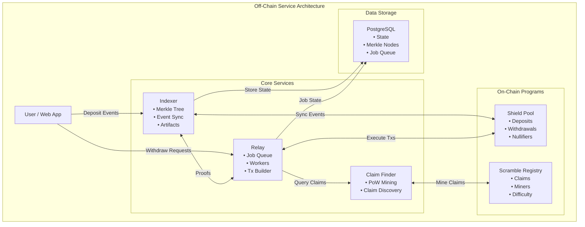

# Off-Chain Services Overview

Cloak's off-chain infrastructure consists of two primary services that coordinate privacy-preserving operations between users and the Solana blockchain. These services maintain state, generate cryptographic proofs, and orchestrate complex multi-step workflows.

## Service Architecture



## Services

### Indexer Service

**Purpose:** Maintains the append-only Merkle tree of commitments and provides proof generation infrastructure.

**Port:** `3001` (default)

**Key Responsibilities:**
- Subscribe to `shield-pool` deposit events from Solana
- Append commitments to the Merkle tree
- Persist encrypted note outputs for client discovery
- Serve Merkle roots and inclusion proofs
- Host SP1 verification artifacts
- Provide admin endpoints for development/testing

**Technology:**
- Rust/Axum web framework
- PostgreSQL for Merkle tree storage
- BLAKE3 for Merkle hashing
- Optional CloudWatch integration

**Source:** `services/indexer/`

### Relay Service

**Purpose:** Orchestrates withdraw operations from submission through on-chain execution with PoW claim integration.

**Port:** `3002` (default)

**Key Responsibilities:**
- Accept withdraw requests via HTTP API
- Validate proofs and public inputs
- Queue jobs with retry logic
- Find available PoW claims from miners
- Build and submit Solana transactions
- Track job state and nullifiers
- Provide validator-agent compatible API

**Technology:**
- Rust/Axum web framework
- PostgreSQL for jobs and nullifiers
- Solana RPC client
- Optional Jito bundle integration
- Optional CloudWatch integration

**Source:** `services/relay/`

## Communication Patterns

### 1. Indexer ← Solana Events

The indexer subscribes to deposit events from the `shield-pool` program:

```rust
// Emitted by shield-pool on deposit
Log: "deposit_commit:{hex_commitment}"
```

The indexer:
1. Parses the commitment from the log
2. Appends it to the Merkle tree
3. Updates PostgreSQL with new leaf
4. Serves updated root via API

### 2. Relay → Indexer (HTTP)

The relay queries the indexer for Merkle data:

```
GET /api/v1/merkle/root
GET /api/v1/merkle/proof/:index
GET /api/v1/artifacts/withdraw/:version
```

### 3. Relay → Solana (RPC)

The relay interacts with Solana via RPC:
- Submit transactions (withdraw, claim consumption)
- Query accounts (claims, registry state)
- Fetch slot/blockhash info
- Optional Jito bundle submission

### 4. User → Services (HTTP)

**To Indexer:**
- Request Merkle roots and proofs
- Download SP1 artifacts
- Fetch encrypted notes

**To Relay:**
- Submit withdraw requests
- Check job status
- Validator agent operations

## Data Stores

### PostgreSQL

**Indexer Database (`cloak`):**
- `merkle_nodes` - Tree structure and hashes
- `encrypted_outputs` - User note discovery data
- Schema: `services/indexer/migrations/001_initial_schema.sql`

**Relay Database (`cloak`):**
- `jobs` - Withdraw job state and metadata
- `nullifiers` - Pre-commit nullifier tracking
- Schema: `services/relay/migrations/001_init.sql`

## Deployment

### Docker Compose

The repository includes a `compose.yml` for local development:

```bash
# Start infrastructure (PostgreSQL + Relay)
docker compose up -d

# PostgreSQL is on port 5434
# Relay is on port 3002
```

**Note:** The indexer service is commented out in `compose.yml` and typically run separately during development.

### Environment Configuration

Both services use environment variables for configuration:

**Indexer:**
- `DB_HOST`, `DB_PORT`, `DB_NAME`, `DB_USER`, `DB_PASSWORD`
- `PORT` - HTTP server port
- `SOLANA_RPC_URL` - Solana cluster endpoint
- `SHIELD_POOL_PROGRAM_ID` - Shield pool program to monitor
- `TREE_HEIGHT` - Merkle tree depth (default: 32)

**Relay:**
- Database URL (PostgreSQL)
- Solana RPC URL
- Program IDs (shield-pool, scramble-registry)
- Optional Jito bundle endpoint
- PoW configuration

See individual service documentation for complete configuration details.

## Service Dependencies

```
Relay depends on:
  ├── PostgreSQL (jobs, nullifiers)
  ├── Indexer (Merkle proofs, artifacts)
  ├── Solana RPC (transaction submission)
  ├── Scramble Registry (PoW claims)
  └── Optional: Jito (priority transactions)

Indexer depends on:
  ├── PostgreSQL (Merkle tree, outputs)
  ├── Solana RPC (event subscription)
  └── Shield Pool (deposit events)
```

## Health Checks

Both services expose health check endpoints:

```bash
# Indexer
curl http://localhost:3001/health

# Relay
curl http://localhost:3002/health
```

Health checks verify:
- HTTP server is running
- Database connectivity (relay only)

## Observability

### Logging

Both services use `tracing` for structured logging:

```bash
# Set log level
RUST_LOG=info,tower_http=debug cargo run

# Available levels: trace, debug, info, warn, error
```

Logs include:
- HTTP request/response spans
- Database query performance
- Job processing events
- PoW claim discovery metrics
- Error traces

### Metrics

Key metrics logged with `[METRICS]` prefix:

**Indexer:**
- Merkle tree operations
- Database query times
- Event ingestion rate
- Artifact requests

**Relay:**
- Job queue depth
- Processing latency
- Claim search duration
- Transaction success/failure rates
- Nullifier duplicate attempts

### CloudWatch Integration

Both services support optional AWS CloudWatch logging:

```bash
# Enable CloudWatch
CLOUDWATCH_ENABLED=true
AWS_ACCESS_KEY_ID=...
AWS_SECRET_ACCESS_KEY=...
AWS_REGION=us-east-1
CLOUDWATCH_LOG_GROUP=Cloak
```

See [`operations/metrics-guide.md`](../operations/metrics-guide.md) for detailed metrics documentation.

## Development Workflow

### 1. Setup Local Environment

```bash
# Clone repository
git clone https://github.com/cloak-labz/cloak
cd cloak

# Start PostgreSQL + Relay via Docker
docker compose up -d postgres

# Run indexer locally
cd services/indexer
cargo run

# Run relay locally (in another terminal)
cd services/relay
cargo run
```

### 2. Test Services

```bash
# Check indexer health
curl http://localhost:3001/health

# Get Merkle root
curl http://localhost:3001/api/v1/merkle/root

# Check relay health
curl http://localhost:3002/health

# Get relay info
curl http://localhost:3002/
```

### 3. Running Tests

```bash
# Indexer tests
cargo test -p indexer

# Relay tests
cargo test -p relay

# Integration tests (requires running services)
cargo test -p relay --test '*' -- --ignored
```

## Next Steps

- **Indexer Details:** [`offchain/indexer.md`](./indexer.md)
- **Relay Details:** [`offchain/relay.md`](./relay.md)
- **API Reference:** [`api/indexer.md`](../api/indexer.md), [`api/relay.md`](../api/relay.md)
- **Operations Guide:** [`operations/runbook.md`](../operations/runbook.md)
- **Deployment:** [`operations/deployment.md`](../operations/deployment.md)
