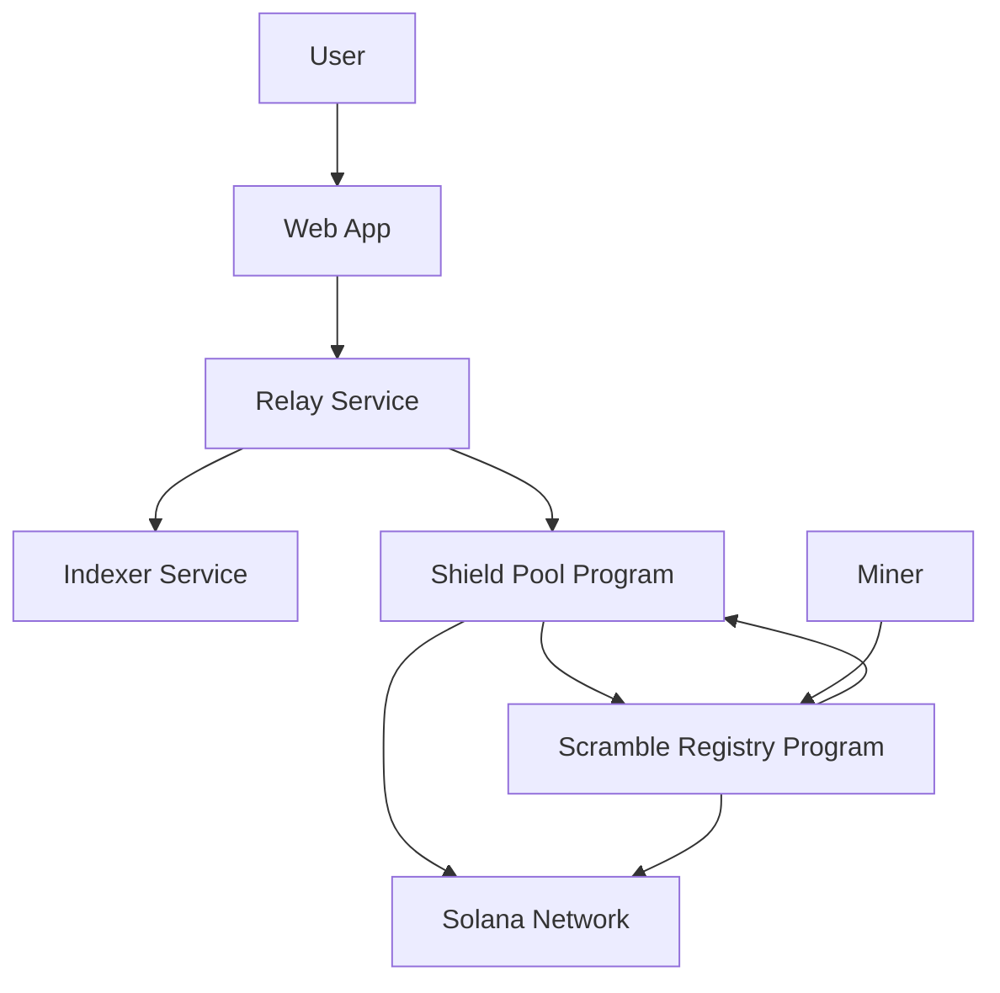
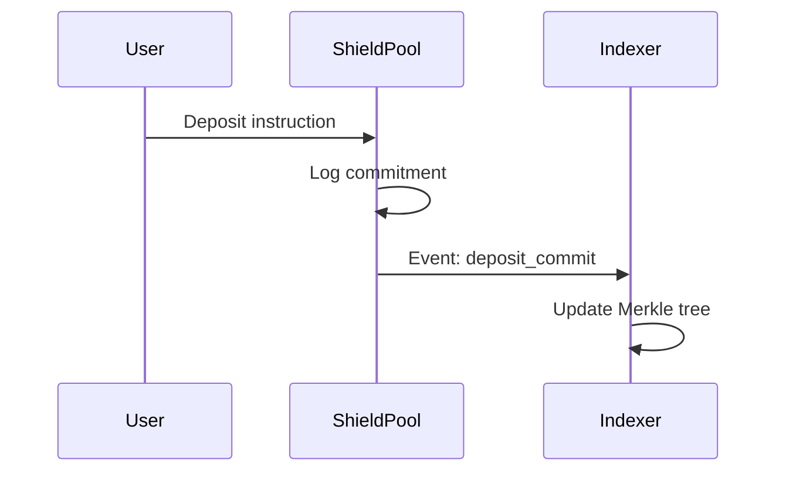
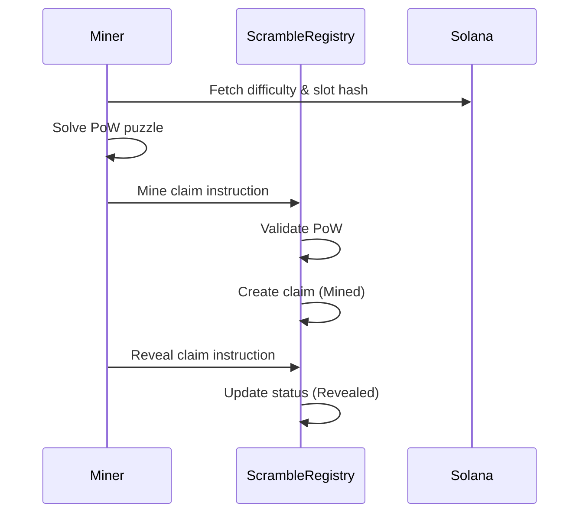
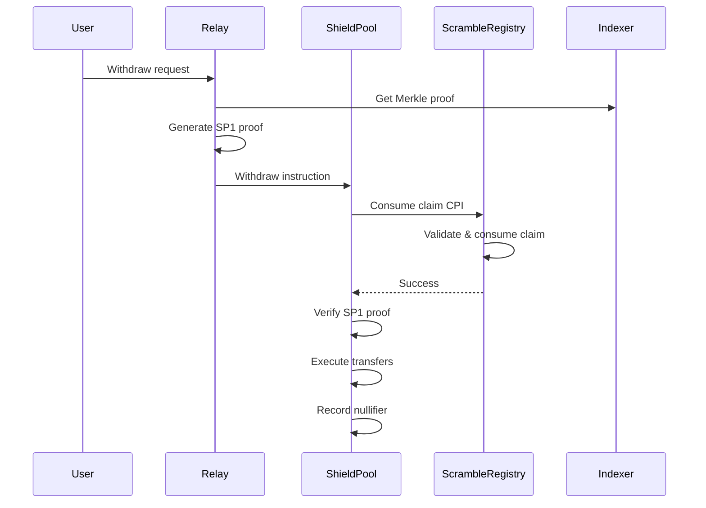
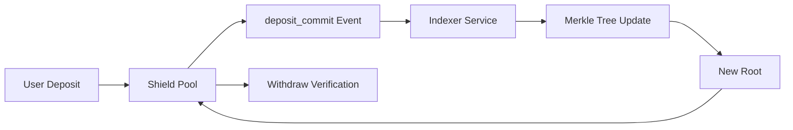
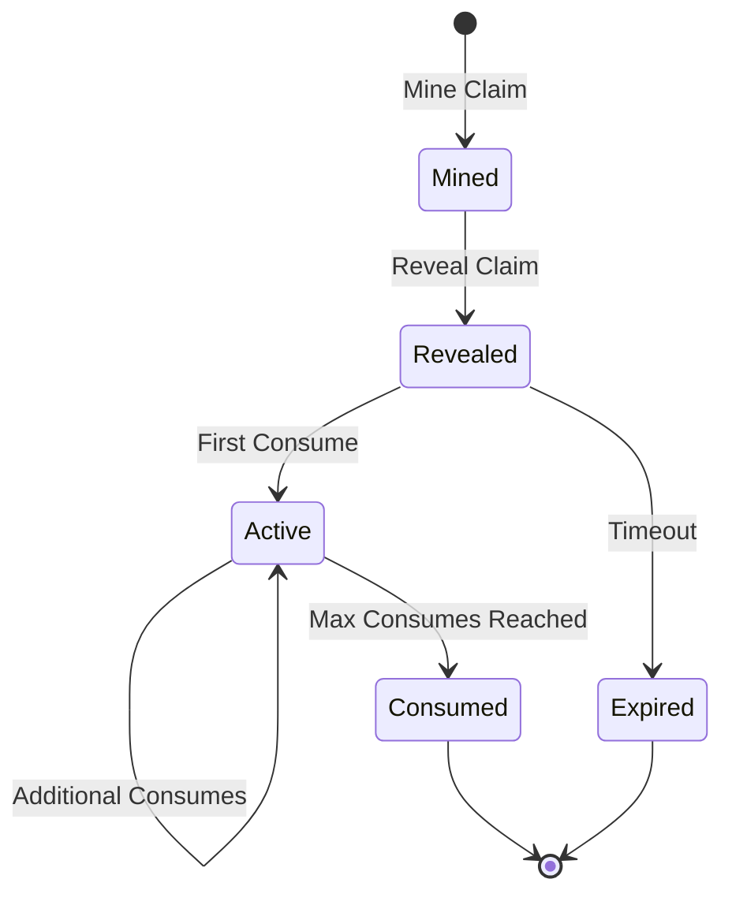

# Program Integration

The Cloak protocol consists of two main on-chain programs that work together to provide privacy-preserving withdrawals with proof-of-work mining incentives.

## Architecture Overview



## Program Responsibilities

### Shield Pool Program
- **Primary Function**: Privacy-preserving withdrawals
- **Core Features**:
  - SP1 proof verification
  - Merkle root management
  - Nullifier tracking
  - Lamport transfers
- **Integration Points**: Consumes claims from Scramble Registry

### Scramble Registry Program
- **Primary Function**: Proof-of-work mining system
- **Core Features**:
  - PoW claim generation
  - Difficulty adjustment
  - Miner management
  - Claim lifecycle
- **Integration Points**: Provides claims to Shield Pool

## Integration Flow

### 1. Deposit Phase


### 2. Mining Phase


### 3. Withdrawal Phase


## CPI Integration Details

### Shield Pool → Scramble Registry

The Shield Pool program makes Cross-Program Invocation (CPI) calls to the Scramble Registry to consume claims:

```rust
// In Shield Pool withdraw instruction
let consume_claim_ix = Instruction {
    program_id: SCRAMBLE_REGISTRY_PROGRAM_ID,
    accounts: vec![
        AccountMeta::new(claim_pubkey, false),
        AccountMeta::new(miner_pubkey, false),
        AccountMeta::new(registry_pubkey, false),
        AccountMeta::new_readonly(shield_pool_program_id, false),
        AccountMeta::new_readonly(clock_sysvar, false),
    ],
    data: consume_claim_data,
};

// Execute CPI
invoke(&consume_claim_ix, &accounts)?;
```

### CPI Security

The Scramble Registry validates CPI calls by checking:

1. **Program ID**: Verifies caller is the expected Shield Pool program
2. **Account Validation**: Ensures correct account structure
3. **Claim Status**: Verifies claim is revealed and not expired
4. **Consumption Limits**: Checks claim hasn't reached max_consumes

## Data Flow

### Merkle Tree Integration



### Claim Lifecycle Integration



## Account Relationships

### Shield Pool Accounts
- **Pool**: Main account holding deposited lamports
- **RootsRing**: Ring buffer of recent Merkle roots
- **NullifierShard**: Tracks used nullifiers
- **Treasury**: Receives withdrawal fees

### Scramble Registry Accounts
- **Registry**: Global mining parameters and statistics
- **Miner**: Per-miner tracking account
- **Claim**: Individual PoW claim account

### Cross-Program Account Sharing
- **Clock Sysvar**: Both programs use for timing
- **System Program**: Account creation and transfers
- **SlotHashes Sysvar**: Scramble Registry uses for PoW validation

## Error Handling

### Shield Pool Errors
- **InvalidRoot**: Merkle root not found in RootsRing
- **ProofInvalid**: SP1 proof verification failed
- **DoubleSpend**: Nullifier already used
- **Conservation**: Amount conservation violated

### Scramble Registry Errors
- **InvalidProofHash**: PoW verification failed
- **DifficultyNotMet**: Solution doesn't meet difficulty
- **ClaimExpired**: Claim past expiration
- **FullyConsumed**: Claim already fully consumed

### Integration Errors
- **CPI Failure**: Cross-program invocation failed
- **Account Mismatch**: Wrong account structure
- **Authority Mismatch**: Unauthorized operation

## Performance Considerations

### Gas Optimization
- **Batch Operations**: Multiple operations in single transaction
- **Account Reuse**: Minimize account creation overhead
- **Efficient Hashing**: BLAKE3 for consistent performance

### Scalability
- **Nullifier Sharding**: Distribute nullifier storage
- **Root Ring Buffer**: Limit Merkle root storage
- **Claim Expiration**: Automatic cleanup of expired claims

## Security Model

### Trust Assumptions
- **SP1 Proofs**: Cryptographic guarantees for withdrawals
- **PoW Difficulty**: Economic incentives for honest mining
- **SlotHashes Sysvar**: Solana's slot hash integrity
- **CPI Security**: Cross-program invocation validation

### Attack Vectors
- **Double-Spending**: Prevented by nullifier tracking
- **Mining Manipulation**: Mitigated by difficulty adjustment
- **Replay Attacks**: Prevented by slot hash validation
- **Authority Attacks**: Mitigated by proper signature verification

## Monitoring and Metrics

### Key Metrics
- **Withdrawal Volume**: Total lamports withdrawn
- **Mining Activity**: Claims mined per slot
- **Difficulty Trends**: Mining difficulty over time
- **Fee Distribution**: Fees earned by miners
- **Claim Utilization**: Percentage of claims consumed

### Health Indicators
- **Root Freshness**: Age of latest Merkle root
- **Nullifier Capacity**: Usage of nullifier shards
- **Mining Competition**: Number of active miners
- **Claim Expiration**: Rate of expired claims

## Future Enhancements

### Planned Features
- **Dynamic Fees**: Adjustable fee rates based on demand
- **Pool Mining**: Collaborative mining pools
- **Cross-Chain**: Support for other blockchain networks
- **Advanced PoW**: Alternative proof-of-work algorithms

### Integration Improvements
- **Batch Withdrawals**: Multiple withdrawals in single transaction
- **Claim Bundling**: Multiple claims per withdrawal
- **Fee Optimization**: Dynamic fee calculation
- **Monitoring APIs**: Enhanced observability endpoints
