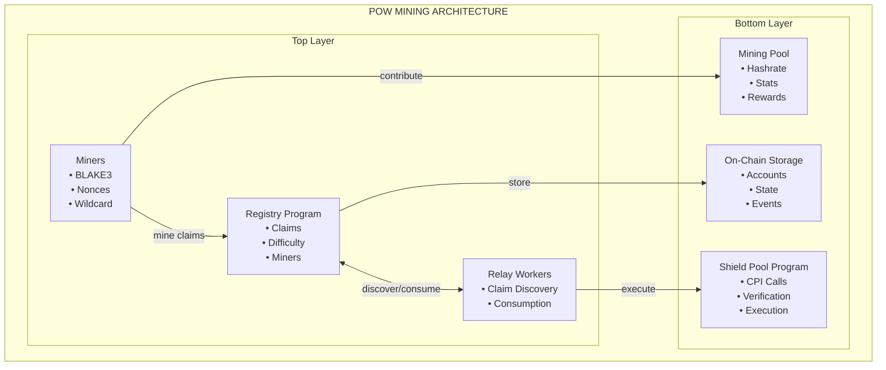
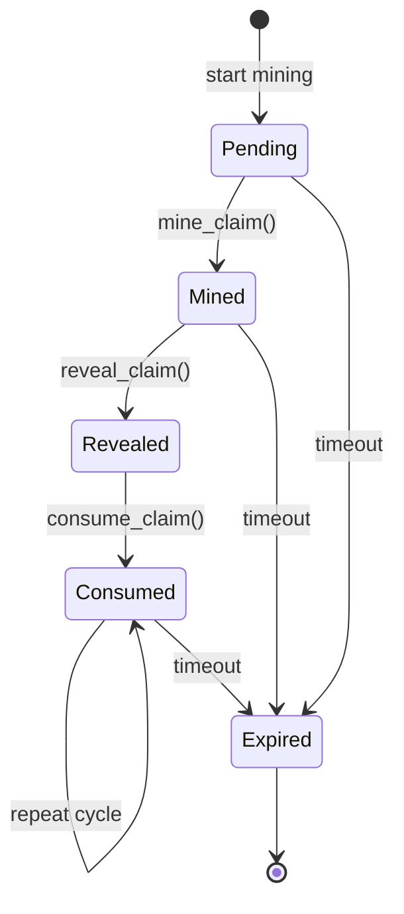

# Proof-of-Work Mining System

The Proof-of-Work (PoW) mining system is Cloak's economic incentive layer that enables prioritized transaction processing through computational work. Miners generate BLAKE3-based proof-of-work claims that can be consumed during withdrawals, creating a marketplace for priority processing while maintaining privacy guarantees.

## System Overview

### Core Purpose

The PoW system serves three primary functions:
1. **Priority Processing** - Claims enable faster withdrawal processing
2. **Economic Incentives** - Miners earn rewards for computational work
3. **Decentralization** - Distributed mining prevents centralization

### Architecture



## Core Components

### 1. Scramble Registry Program

**Purpose:** On-chain management of miners, claims, and mining parameters.

**Key Features:**
- Miner registration and management
- Claim lifecycle tracking
- Difficulty adjustment mechanism
- Wildcard claim validation
- Consumption tracking and limits

**Account Structure:**
```rust
// Registry state account
pub struct RegistryState {
    pub authority: Pubkey,              // Admin authority
    pub difficulty_target: u64,         // Current difficulty
    pub total_miners: u32,              // Registered miners count
    pub total_claims: u64,              // Total claims mined
    pub total_consumptions: u64,        // Total consumptions
    pub bump: u8,                       // PDA bump
}

// Miner account
pub struct MinerAccount {
    pub authority: Pubkey,              // Miner authority
    pub registered_slot: u64,           // Registration slot
    pub total_claims: u32,              // Claims mined by this miner
    pub total_consumptions: u32,        // Consumptions by this miner
    pub bump: u8,                       // PDA bump
}

// Claim account
pub struct ClaimAccount {
    pub miner_pda: Pubkey,              // Associated miner
    pub miner_authority: Pubkey,        // Miner authority
    pub hash: [u8; 32],                 // Mined hash
    pub mined_slot: u64,                // Slot when mined
    pub revealed_slot: Option<u64>,     // Slot when revealed
    pub batch_hash: [u8; 32],           // Batch hash (wildcard = [0; 32])
    pub consumption_count: u8,          // Times consumed
    pub max_consumptions: u8,           // Max consumptions allowed
    pub expires_at_slot: u64,           // Expiration slot
    pub bump: u8,                       // PDA bump
}
```

### 2. Cloak Miner Client

**Purpose:** Standalone mining client for generating wildcard claims.

**Key Features:**
- BLAKE3-based mining algorithm
- Wildcard claim generation
- Multi-threaded mining
- Real-time statistics
- Automatic claim submission

**Mining Algorithm:**
```rust
// Mining preimage structure
pub struct MiningPreimage {
    pub domain: [u8; 17],              // "CLOAK:SCRAMBLE:v1"
    pub slot: u64,                      // Current slot
    pub slot_hash: [u8; 32],           // Slot hash
    pub miner_pubkey: [u8; 32],        // Miner public key
    pub batch_hash: [u8; 32],          // [0; 32] for wildcard
    pub nonce: u128,                    // Mining nonce
}

// Mining process
pub fn mine_wildcard_claim(
    difficulty_target: u64,
    slot: u64,
    slot_hash: [u8; 32],
    miner_pubkey: [u8; 32],
) -> Result<MiningPreimage> {
    let mut nonce = 0u128;
    
    loop {
        let preimage = MiningPreimage {
            domain: *b"CLOAK:SCRAMBLE:v1",
            slot,
            slot_hash,
            miner_pubkey,
            batch_hash: [0u8; 32], // Wildcard
            nonce,
        };
        
        let hash = blake3(&serialize(&preimage));
        let hash_u64 = u64::from_le_bytes(hash.as_bytes()[0..8].try_into()?);
        
        if hash_u64 < difficulty_target {
            return Ok(preimage);
        }
        
        nonce += 1;
    }
}
```

### 3. Relay Claim Discovery

**Purpose:** Service integration for finding and consuming available claims.

**Key Features:**
- Wildcard claim discovery
- Claim availability checking
- Consumption tracking
- Fallback mechanisms

**ClaimFinder Implementation:**
```rust
pub struct ClaimFinder {
    rpc_client: RpcClient,
    registry_program_id: Pubkey,
}

impl ClaimFinder {
    pub async fn find_wildcard_claim(&self) -> Result<Option<AvailableClaim>> {
        // Get all claim accounts
        let claim_accounts = self.rpc_client
            .get_program_accounts(&self.registry_program_id)
            .await?;
        
        let current_slot = self.rpc_client.get_slot().await?;
        
        // Filter for available wildcard claims
        for (pubkey, account) in claim_accounts {
            if let Ok(claim_data) = ClaimAccount::try_from_slice(&account.data) {
                if claim_data.batch_hash == [0u8; 32] && // Wildcard
                   claim_data.revealed_slot.is_some() && // Revealed
                   claim_data.expires_at_slot > current_slot && // Not expired
                   claim_data.consumption_count < claim_data.max_consumptions { // Not fully consumed
                    
                    return Ok(Some(AvailableClaim {
                        claim_pda: pubkey,
                        miner_pda: claim_data.miner_pda,
                        miner_authority: claim_data.miner_authority,
                        mined_slot: claim_data.mined_slot,
                        revealed_slot: claim_data.revealed_slot.unwrap(),
                        batch_hash: claim_data.batch_hash,
                        hash: claim_data.hash,
                        consumption_count: claim_data.consumption_count,
                        max_consumptions: claim_data.max_consumptions,
                        expires_at_slot: claim_data.expires_at_slot,
                    }));
                }
            }
        }
        
        Ok(None)
    }
}
```

### 4. Shield Pool Integration

**Purpose:** On-chain consumption of PoW claims during withdrawals.

**Key Features:**
- CPI calls to scramble registry
- Claim consumption validation
- Wildcard claim support
- Consumption limit enforcement

**CPI Implementation:**
```rust
// In shield-pool program
pub fn withdraw_with_pow(
    ctx: Context<WithdrawWithPow>,
    proof: [u8; 260],
    public_inputs: [u8; 104],
    outputs: Vec<Output>,
) -> Result<()> {
    // ... standard withdraw validation ...
    
    // Consume PoW claim via CPI
    let consume_claim_ctx = CpiContext::new(
        ctx.accounts.scramble_registry.to_account_info(),
        ConsumeClaim {
            claim: ctx.accounts.claim.to_account_info(),
            miner: ctx.accounts.miner.to_account_info(),
            authority: ctx.accounts.authority.to_account_info(),
        },
    );
    
    // Compute batch hash from outputs
    let batch_hash = compute_batch_hash(&outputs);
    
    scramble_registry::cpi::consume_claim(
        consume_claim_ctx,
        batch_hash,
    )?;
    
    // ... rest of withdraw logic ...
}
```

## Claim Lifecycle

### State Transitions



### Detailed Lifecycle

**1. Mining Phase (Pending → Mined)**
```rust
// Miner submits mined hash
pub fn mine_claim(
    ctx: Context<MineClaim>,
    hash: [u8; 32],
) -> Result<()> {
    let claim = &mut ctx.accounts.claim;
    let miner = &mut ctx.accounts.miner;
    
    // Verify hash meets difficulty
    let hash_u64 = u64::from_le_bytes(hash[0..8].try_into()?);
    require!(hash_u64 < difficulty_target, ErrorCode::DifficultyNotMet);
    
    // Store claim data
    claim.hash = hash;
    claim.mined_slot = Clock::get()?.slot;
    claim.miner_pda = miner.key();
    claim.miner_authority = miner.authority;
    claim.expires_at_slot = claim.mined_slot + CLAIM_LIFETIME_SLOTS;
    
    // Update miner stats
    miner.total_claims += 1;
    
    Ok(())
}
```

**2. Revelation Phase (Mined → Revealed)**
```rust
// Miner reveals preimage after reveal window
pub fn reveal_claim(
    ctx: Context<RevealClaim>,
    preimage: ClaimPreimage,
) -> Result<()> {
    let claim = &mut ctx.accounts.claim;
    
    // Verify reveal window is open
    let current_slot = Clock::get()?.slot;
    let reveal_window_start = claim.mined_slot + REVEAL_WINDOW_DELAY;
    require!(current_slot >= reveal_window_start, ErrorCode::RevealWindowNotOpen);
    
    // Verify preimage matches hash
    let computed_hash = blake3(&serialize(&preimage));
    require!(computed_hash == claim.hash, ErrorCode::PreimageMismatch);
    
    // Mark as revealed
    claim.revealed_slot = Some(current_slot);
    
    Ok(())
}
```

**3. Consumption Phase (Revealed → Consumed)**
```rust
// Relay consumes claim during withdraw
pub fn consume_claim(
    ctx: Context<ConsumeClaim>,
    batch_hash: [u8; 32],
) -> Result<()> {
    let claim = &mut ctx.accounts.claim;
    let miner = &mut ctx.accounts.miner;
    
    // Verify claim is revealed
    require!(claim.revealed_slot.is_some(), ErrorCode::ClaimNotRevealed);
    
    // Check not expired
    let current_slot = Clock::get()?.slot;
    require!(claim.expires_at_slot > current_slot, ErrorCode::ClaimExpired);
    
    // Check consumption limit
    require!(claim.consumption_count < claim.max_consumptions, ErrorCode::ClaimFullyConsumed);
    
    // Verify batch hash (wildcard allows any)
    if claim.batch_hash != [0u8; 32] {
        require!(claim.batch_hash == batch_hash, ErrorCode::BatchHashMismatch);
    }
    
    // Increment consumption
    claim.consumption_count += 1;
    miner.total_consumptions += 1;
    
    Ok(())
}
```

## Mining Algorithm

### BLAKE3-Based Mining

**Preimage Structure:**
```
Domain:       "CLOAK:SCRAMBLE:v1"  (17 bytes)
Slot:         u64 LE               (8 bytes)
Slot Hash:    [u8; 32]             (32 bytes)
Miner Pubkey: [u8; 32]             (32 bytes)
Batch Hash:   [u8; 32]             (32 bytes) - [0; 32] for wildcard
Nonce:        u128 LE              (16 bytes)
Total:        137 bytes
```

**Mining Process:**
```rust
pub fn mine_claim(
    difficulty_target: u64,
    slot: u64,
    slot_hash: [u8; 32],
    miner_pubkey: [u8; 32],
    batch_hash: [u8; 32],
) -> Result<ClaimPreimage> {
    let mut nonce = 0u128;
    let start_time = std::time::Instant::now();
    
    loop {
        // Build preimage
        let mut preimage = Vec::with_capacity(137);
        preimage.extend_from_slice(b"CLOAK:SCRAMBLE:v1"); // 17 bytes
        preimage.extend_from_slice(&slot.to_le_bytes());   // 8 bytes
        preimage.extend_from_slice(&slot_hash);            // 32 bytes
        preimage.extend_from_slice(&miner_pubkey);         // 32 bytes
        preimage.extend_from_slice(&batch_hash);           // 32 bytes
        preimage.extend_from_slice(&nonce.to_le_bytes());  // 16 bytes
        
        // Hash and check difficulty
        let hash = blake3(&preimage);
        let hash_u64 = u64::from_le_bytes(hash.as_bytes()[0..8].try_into()?);
        
        if hash_u64 < difficulty_target {
            return Ok(ClaimPreimage {
                domain: *b"CLOAK:SCRAMBLE:v1",
                slot,
                slot_hash,
                miner_pubkey,
                batch_hash,
                nonce,
                hash: hash.as_bytes().try_into()?,
            });
        }
        
        nonce += 1;
        
        // Progress reporting
        if nonce % 1_000_000 == 0 {
            let elapsed = start_time.elapsed();
            let rate = nonce as f64 / elapsed.as_secs_f64();
            info!("Mining progress: {} nonces, {:.2} H/s", nonce, rate);
        }
    }
}
```

### Difficulty Adjustment

**Target Calculation:**
```rust
// Difficulty is represented as a target value
// Lower target = higher difficulty
pub fn calculate_difficulty_target(difficulty: u64) -> u64 {
    // Target = 2^64 / difficulty
    u64::MAX / difficulty
}

// Example difficulties:
// difficulty = 1,000,000 → target = 18,446,744,073,709,551
// difficulty = 10,000,000 → target = 1,844,674,407,370,955
```

**Dynamic Adjustment:**
```rust
pub fn adjust_difficulty(
    current_difficulty: u64,
    target_block_time: u64,
    actual_block_time: u64,
) -> u64 {
    let adjustment_factor = actual_block_time as f64 / target_block_time as f64;
    
    if adjustment_factor > 1.1 {
        // Too slow, decrease difficulty
        (current_difficulty as f64 * 0.9) as u64
    } else if adjustment_factor < 0.9 {
        // Too fast, increase difficulty
        (current_difficulty as f64 * 1.1) as u64
    } else {
        // Within acceptable range
        current_difficulty
    }
}
```

## Economic Model

### Mining Economics

**Cost Structure:**
- **Computational Cost:** CPU cycles for BLAKE3 hashing
- **Energy Cost:** Electricity consumption
- **Opportunity Cost:** Alternative mining opportunities

**Revenue Streams:**
- **Claim Consumption:** Fees from claim usage
- **Priority Processing:** Premium for faster withdrawals
- **Network Rewards:** Protocol-level incentives

### Fee Structure

**Claim Consumption Fees:**
```rust
pub fn calculate_consumption_fee(claim_value: u64) -> u64 {
    // Base fee + percentage of claim value
    let base_fee = 1_000_000; // 0.001 SOL
    let percentage_fee = (claim_value * 1) / 1000; // 0.1%
    
    base_fee + percentage_fee
}
```

**Miner Rewards:**
```rust
pub fn calculate_miner_reward(
    consumption_count: u8,
    max_consumptions: u8,
    base_reward: u64,
) -> u64 {
    // Reward decreases as claim is consumed
    let utilization_rate = consumption_count as f64 / max_consumptions as f64;
    let reward_multiplier = 1.0 - (utilization_rate * 0.5); // Max 50% reduction
    
    (base_reward as f64 * reward_multiplier) as u64
}
```

### Market Dynamics

**Supply and Demand:**
- **Supply:** Controlled by mining difficulty and computational resources
- **Demand:** Driven by withdrawal volume and priority needs
- **Equilibrium:** Difficulty adjusts to maintain target claim availability

**Price Discovery:**
- **Wildcard Claims:** Universal applicability increases value
- **Specific Claims:** Lower value due to limited applicability
- **Consumption Limits:** Multiple uses increase claim value

## Performance Metrics

### Mining Performance

**Hashrate Targets:**
- **Individual Miner:** 1-10 MH/s (million hashes per second)
- **Network Total:** 100+ MH/s
- **Target Block Time:** 10-60 seconds per claim

**Efficiency Metrics:**
```rust
pub struct MiningMetrics {
    pub hashrate: f64,              // Hashes per second
    pub power_consumption: f64,     // Watts
    pub efficiency: f64,            // Hashes per joule
    pub success_rate: f64,          // Claims per hour
    pub profitability: f64,         // Revenue per hour
}
```

### Network Performance

**Claim Availability:**
- **Target:** 10-50 available claims at any time
- **Wildcard Ratio:** 80%+ wildcard claims
- **Consumption Rate:** 1-10 claims per minute

**Latency Metrics:**
- **Mining Time:** 10-60 seconds (p95)
- **Reveal Time:** 60-300 seconds after mining
- **Consumption Time:** < 1 second

## Security Considerations

### Cryptographic Security

**Hash Function Security:**
- **BLAKE3-256:** 128-bit security level
- **Collision Resistance:** 2^128 operations
- **Preimage Resistance:** 2^256 operations

**Mining Security:**
- **Nonce Randomness:** Secure random number generation
- **Preimage Protection:** Preimages only revealed after mining
- **Hash Validation:** On-chain verification of difficulty

### Economic Security

**Sybil Resistance:**
- **Registration Cost:** Miner registration requires SOL
- **Computational Cost:** Mining requires significant resources
- **Reputation System:** Miner performance tracking

**Attack Prevention:**
- **Difficulty Adjustment:** Prevents mining monopolies
- **Consumption Limits:** Prevents claim hoarding
- **Expiration Mechanism:** Prevents indefinite storage

## Monitoring and Analytics

### Key Metrics

**Mining Metrics:**
```rust
// Prometheus metrics
lazy_static! {
    static ref MINING_HASHRATE: Gauge = Gauge::new("mining_hashrate", "Current mining hashrate").unwrap();
    static ref CLAIMS_MINED_TOTAL: Counter = Counter::new("claims_mined_total", "Total claims mined").unwrap();
    static ref CLAIMS_CONSUMED_TOTAL: Counter = Counter::new("claims_consumed_total", "Total claims consumed").unwrap();
    static ref MINING_DIFFICULTY: Gauge = Gauge::new("mining_difficulty", "Current mining difficulty").unwrap();
    static ref CLAIM_AVAILABILITY: Gauge = Gauge::new("claim_availability", "Available claims count").unwrap();
}
```

**Network Health:**
- **Claim Supply:** Number of available claims
- **Consumption Rate:** Claims consumed per time period
- **Mining Participation:** Active miners count
- **Difficulty Stability:** Difficulty adjustment frequency

### Dashboard Configuration

**Grafana Panels:**
```json
{
  "title": "PoW Mining Dashboard",
  "panels": [
    {
      "title": "Mining Hashrate",
      "type": "graph",
      "targets": [
        {
          "expr": "mining_hashrate",
          "legendFormat": "Hashrate (H/s)"
        }
      ]
    },
    {
      "title": "Claim Availability",
      "type": "stat",
      "targets": [
        {
          "expr": "claim_availability",
          "legendFormat": "Available Claims"
        }
      ]
    },
    {
      "title": "Consumption Rate",
      "type": "graph",
      "targets": [
        {
          "expr": "rate(claims_consumed_total[5m])",
          "legendFormat": "Claims/min"
        }
      ]
    }
  ]
}
```

## Related Documentation

- **[PoW Quick Reference](../POW_QUICK_REFERENCE.md)** - Commands and API reference
- **[PoW Integration Guide](../POW_INTEGRATION_GUIDE.md)** - Integration with relay and shield pool
- **[Cloak Miner Package](../packages/cloak-miner.md)** - Mining client documentation
- **[Scramble Registry Program](../onchain/scramble-registry.md)** - On-chain program details
- **[PoW Withdrawal Workflow](../workflows/pow-withdraw.md)** - Enhanced withdrawal process
- **[Operations Metrics Guide](../operations/metrics-guide.md)** - Monitoring and alerting
