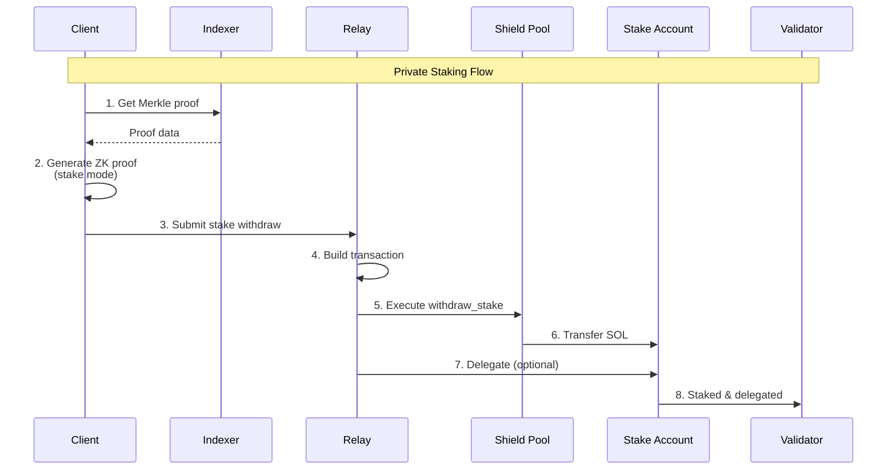

# Private Staking Workflow

The private staking workflow allows users to stake SOL to validators privately, breaking the link between the original deposit and the staking transaction. This guide covers the complete end-to-end process from note preparation to on-chain stake delegation.

## Overview

Private staking enables users to:
1. Withdraw SOL from the shield pool privately
2. Transfer funds directly to a stake account
3. Delegate to a validator without revealing the source of funds

The process uses the same zero-knowledge proof system as regular withdrawals, but instead of sending to regular addresses, funds are sent to a stake account that can be delegated to a validator.

### Key Concepts

**Stake Account:** A Solana account that holds staked SOL and can be delegated to a validator.

**Stake Authority:** The public key that controls the stake account (can delegate, withdraw, etc.).

**Validator Vote Account:** The validator's vote account address that receives the delegation.

**Stake Mode Withdrawal:** A special withdrawal mode where:
- Outputs array is empty (no regular recipients)
- Funds go directly to a stake account
- The `outputs_hash` is computed as `BLAKE3(stake_account || public_amount)`

### Architecture Diagram



## Prerequisites

Before staking privately, you need:

1. **A deposited note** in the shield pool (see [Deposit Workflow](./deposit.md))
2. **A stake account** (can be created before or during the process)
3. **Stake authority** keypair (controls the stake account)
4. **Validator vote account** address (the validator you want to delegate to)

## Step 1: Prepare Stake Account

The stake account must exist before the withdraw transaction. You can create it beforehand or the relay can create it (if configured).

### Create Stake Account (Client-Side)

```typescript
import {
  Connection,
  Keypair,
  PublicKey,
  SystemProgram,
  Transaction,
} from '@solana/web3.js';
import {
  Authorized,
  Lockup,
  StakeProgram,
} from '@solana/web3.js';

async function createStakeAccount(
  connection: Connection,
  payer: Keypair,
  stakeAuthority: PublicKey
): Promise<{ stakeAccount: Keypair; signature: string }> {
  // Generate stake account keypair
  const stakeAccount = Keypair.generate();

  // Get rent exemption amount
  const rentExemptAmount = await connection.getMinimumBalanceForRentExemption(
    StakeProgram.space
  );

  // Create account instruction
  const createIx = SystemProgram.createAccount({
    fromPubkey: payer.publicKey,
    newAccountPubkey: stakeAccount.publicKey,
    lamports: rentExemptAmount,
    space: StakeProgram.space,
    programId: StakeProgram.programId,
  });

  // Initialize stake account
  const authorized = new Authorized(stakeAuthority, stakeAuthority);
  const lockup = new Lockup(0, PublicKey.default, 0);
  const initializeIx = StakeProgram.initialize({
    stakePubkey: stakeAccount.publicKey,
    authorized,
    lockup,
  });

  // Build and send transaction
  const tx = new Transaction().add(createIx, initializeIx);
  const signature = await connection.sendTransaction(tx, [
    payer,
    stakeAccount,
  ]);

  await connection.confirmTransaction(signature);

  return { stakeAccount, signature };
}
```

### Using Cloak SDK

```typescript
import { CloakSDK } from '@cloak/sdk';
import { Connection, PublicKey } from '@solana/web3.js';

const sdk = new CloakSDK({
  keypairBytes: wallet.secretKey,
  network: 'devnet',
});

// Create a note (or use existing)
const note = sdk.generateNote(10_000_000_000); // 10 SOL

// Create stake account (or use existing)
const stakeAccount = new PublicKey('...'); // Your stake account
const stakeAuthority = new PublicKey('...'); // Authority key
const validatorVoteAccount = new PublicKey('...'); // Validator

// Stake privately
const result = await sdk.privateStake(
  connection,
  note,
  {
    stakeAccount,
    stakeAuthority,
    validatorVoteAccount,
  },
  {
    onProgress: (status) => console.log(status),
    onProofProgress: (pct) => console.log(`Proof: ${pct}%`),
  }
);

console.log('✅ Staked! TX:', result.signature);
console.log('Stake account:', result.stakeAccount);
console.log('Amount staked:', result.stakeAmount);
```

## Step 2: Prepare Proof Inputs (Stake Mode)

The proof inputs for staking are similar to regular withdrawals, but with empty outputs and stake parameters.

### Private Inputs

```typescript
interface PrivateInputs {
  amount: number;           // u64 lamports
  r: string;                // 32-byte hex
  sk_spend: string;         // 32-byte hex
  leaf_index: number;       // u32
  merkle_path: {
    path_elements: string[]; // Array of 32-byte hex
    path_indices: number[];  // Array of 0 or 1
  };
}

// Same as regular withdrawal
const privateInputs: PrivateInputs = {
  amount: note.amount,
  r: toHex(note.r),
  sk_spend: toHex(note.sk_spend),
  leaf_index: note.leaf_index,
  merkle_path: {
    path_elements: proof.path_elements.map(toHex),
    path_indices: proof.path_indices,
  },
};
```

### Public Inputs

```typescript
interface PublicInputs {
  root: string;         // 32-byte hex (Merkle root)
  nf: string;           // 32-byte hex (nullifier)
  outputs_hash: string; // 32-byte hex (stake outputs hash)
  amount: number;       // u64 lamports
}

// Compute stake outputs hash
function computeStakeOutputsHash(
  stakeAccount: PublicKey,
  publicAmount: number
): Uint8Array {
  const hasher = blake3.createHash();
  hasher.update(stakeAccount.toBytes()); // 32 bytes
  hasher.update(new Uint8Array(
    new BigUint64Array([BigInt(publicAmount)]).buffer
  )); // 8 bytes LE
  return new Uint8Array(hasher.digest());
}

const stakeOutputsHash = computeStakeOutputsHash(
  stakeAccount,
  note.amount // public_amount, not stake_amount
);

const publicInputs: PublicInputs = {
  root: toHex(proof.root),
  nf: toHex(nullifier),
  outputs_hash: toHex(stakeOutputsHash),
  amount: note.amount,
};
```

### Stake Parameters

```typescript
interface StakeParams {
  stake_account: string; // 32-byte hex (stake account pubkey)
}

// For the ZK circuit
const stakeParams: StakeParams = {
  stake_account: hex::encode(stakeAccount.toBytes()),
};

// Note: The circuit only uses stake_account in StakeParams
// The outputs_hash computation uses: H(stake_account || public_amount)
```

### Outputs (Empty for Stake Mode)

```typescript
// Stake mode requires empty outputs
const outputs: Output[] = [];

// The circuit validates:
// - outputs_sum == 0 (no regular outputs)
// - stake_amount + fee == amount
// - outputs_hash == H(stake_account || public_amount)
```

## Step 3: Generate Zero-Knowledge Proof

Generate the proof with stake parameters included.

### Using SP1 CLI

```bash
cd packages/zk-guest-sp1

# Generate proof with stake_params
cargo run --package zk-guest-sp1-host --bin cloak-zk -- prove \
  --private private.json \
  --public public.json \
  --outputs outputs.json \
  --stake-params stake_params.json \
  --proof out/proof.bin \
  --pubout out/public.bin
```

### Stake Params JSON

```json
{
  "stake_account": "a1b2c3d4e5f6789..."
}
```

### Using Indexer API

```typescript
const proveRequest = {
  private_inputs: JSON.stringify(privateInputs),
  public_inputs: JSON.stringify(publicInputs),
  outputs: JSON.stringify([]), // Empty for stake mode
  stake_params: {
    stake_account: hex::encode(stakeAccount.toBytes()),
  },
};

const response = await fetch(`${indexerUrl}/api/v1/prove`, {
  method: 'POST',
  headers: { 'Content-Type': 'application/json' },
  body: JSON.stringify(proveRequest),
});

const result = await response.json();
const proofHex = result.proof;
```

## Step 4: Submit Stake Withdraw Request

Submit the proof to the relay service with stake configuration.

### Build Request

```typescript
interface StakeWithdrawRequest {
  outputs: Array<{ recipient: string; amount: number }>; // Empty for stake
  stake: {
    stake_account: string;        // Base58 pubkey
    stake_authority: string;       // Base58 pubkey
    validator_vote_account: string; // Base58 pubkey
  };
  policy: {
    fee_bps: number;
  };
  public_inputs: {
    root: string;
    nf: string;
    amount: number;
    fee_bps: number;
    outputs_hash: string;
  };
  proof_bytes: string; // Base64 encoded proof
}

const request: StakeWithdrawRequest = {
  outputs: [], // Empty for stake mode
  stake: {
    stake_account: stakeAccount.toBase58(),
    stake_authority: stakeAuthority.toBase58(),
    validator_vote_account: validatorVoteAccount.toBase58(),
  },
  policy: {
    fee_bps: 60, // 0.6%
  },
  public_inputs: {
    root: toHex(proof.root),
    nf: toHex(nullifier),
    amount: note.amount,
    fee_bps: 60,
    outputs_hash: toHex(stakeOutputsHash),
  },
  proof_bytes: Buffer.from(proofBytes).toString('base64'),
};
```

### Submit to Relay

```typescript
async function submitStakeWithdraw(
  request: StakeWithdrawRequest
): Promise<string> {
  const response = await fetch(`${relayUrl}/withdraw`, {
    method: 'POST',
    headers: { 'Content-Type': 'application/json' },
    body: JSON.stringify(request),
  });

  if (!response.ok) {
    const error = await response.json();
    throw new Error(`Stake withdraw failed: ${error.error}`);
  }

  const result = await response.json();
  return result.data.request_id;
}

// Submit
const requestId = await submitStakeWithdraw(request);
console.log('Request ID:', requestId);
```

### Monitor Status

```typescript
async function waitForStakeCompletion(
  requestId: string,
  timeout = 120_000
): Promise<string> {
  const start = Date.now();
  const pollInterval = 2000;

  while (Date.now() - start < timeout) {
    const response = await fetch(`${relayUrl}/status/${requestId}`);
    const status = await response.json();

    console.log(`Status: ${status.data.status}`);

    if (status.data.status === 'completed') {
      return status.data.tx_id;
    }

    if (status.data.status === 'failed') {
      throw new Error(`Stake failed: ${status.data.error}`);
    }

    await new Promise(resolve => setTimeout(resolve, pollInterval));
  }

  throw new Error('Stake timeout');
}

const txId = await waitForStakeCompletion(requestId);
console.log('✅ Stake completed! TX:', txId);
```

## Step 5: Relay Processing

The relay worker processes the stake withdraw request.

### Processing Flow

1. **Validate Request:**
   - Verify proof format and size
   - Check outputs are empty (stake mode)
   - Validate stake configuration (valid pubkeys)

2. **Verify Proof:**
   - Extract Groth16 proof (260 bytes)
   - Verify against SP1 VKey
   - Check public inputs match

3. **Check Constraints:**
   - Merkle root in recent roots buffer
   - Nullifier not used
   - Outputs hash matches stake account

4. **Build Transaction:**
   - Create `WithdrawStake` instruction
   - Include stake account, authority, validator
   - Add compute budget instructions

5. **Submit:**
   - Sign with fee payer
   - Send to Solana
   - Wait for confirmation

6. **Optional Delegation:**
   - After funds arrive, delegate to validator
   - This can be done in a separate transaction

### Transaction Structure

```rust
// WithdrawStake instruction
Instruction {
    program_id: SHIELD_POOL_PROGRAM_ID,
    accounts: vec![
        AccountMeta::new(pool_pda, false),
        AccountMeta::new(treasury_pda, false),
        AccountMeta::new_readonly(roots_ring_pda, false),
        AccountMeta::new(nullifier_shard_pda, false),
        AccountMeta::new(stake_account, false),      // Receives funds
        AccountMeta::new_readonly(stake_authority, false),
        AccountMeta::new_readonly(validator_vote_account, false),
        AccountMeta::new_readonly(system_program::id(), false),
        AccountMeta::new_readonly(stake_program::id(), false),
    ],
    data: [
        discriminator: 9, // WithdrawStake
        proof: [260 bytes],
        public_inputs: [104 bytes],
        duplicate_nullifier: [32 bytes],
        stake_account: [32 bytes],
    ],
}
```

## Step 6: On-Chain Execution

The shield-pool program validates and executes the stake withdraw.

### WithdrawStake Instruction

```rust
pub fn process_withdraw_stake_instruction(
    accounts: &[AccountInfo],
    data: &[u8],
) -> ProgramResult {
    // 1. Parse instruction data
    let parsed = parse_withdraw_stake_data(data)?;

    // 2. Verify SP1 proof
    verify_proof(
        parsed.proof,
        &parsed.public_inputs[..SP1_PUB_LEN],
        WITHDRAW_VKEY_HASH,
        GROTH16_VK_5_0_0_BYTES,
    )?;

    // 3. Verify Merkle root
    require!(
        roots_ring.contains(&parsed.root),
        ShieldPoolError::RootNotFound
    );

    // 4. Check nullifier
    require!(
        !nullifier_shard.contains(&parsed.nullifier),
        ShieldPoolError::NullifierUsed
    );

    // 5. Mark nullifier as spent
    nullifier_shard.insert(&parsed.nullifier)?;

    // 6. Verify outputs hash
    let mut hasher = blake3::Hasher::new();
    hasher.update(&parsed.stake_account);
    hasher.update(&parsed.public_amount.to_le_bytes());
    let computed_hash = hasher.finalize();
    require!(
        computed_hash.as_bytes() == &parsed.outputs_hash,
        ShieldPoolError::InvalidOutputsHash
    );

    // 7. Calculate fee
    let fee = calculate_fee(parsed.public_amount);
    let stake_amount = parsed.public_amount - fee;

    // 8. Transfer to stake account
    **stake_account.lamports.borrow_mut() += stake_amount;
    **pool.lamports.borrow_mut() -= stake_amount;

    // 9. Transfer fee to treasury
    **treasury.lamports.borrow_mut() += fee;
    **pool.lamports.borrow_mut() -= fee;

    Ok(())
}
```

### Verification Steps

1. **SP1 Proof:** Cryptographically verified
2. **Merkle Root:** Exists in recent roots buffer
3. **Nullifier:** Never used before
4. **Outputs Hash:** Matches `H(stake_account || public_amount)`
5. **Amount Conservation:** `stake_amount + fee == amount`
6. **Funds Transfer:** SOL moved to stake account

## Step 7: Delegate to Validator (Optional)

After funds are in the stake account, delegate to the validator.

### Delegate Instruction

```typescript
import { StakeProgram } from '@solana/web3.js';

async function delegateStake(
  connection: Connection,
  stakeAccount: PublicKey,
  stakeAuthority: Keypair,
  validatorVoteAccount: PublicKey
): Promise<string> {
  const delegateIx = StakeProgram.delegate({
    stakePubkey: stakeAccount,
    authorizedPubkey: stakeAuthority.publicKey,
    votePubkey: validatorVoteAccount,
  });

  const tx = new Transaction().add(delegateIx);
  const signature = await connection.sendTransaction(tx, [stakeAuthority]);

  await connection.confirmTransaction(signature);

  return signature;
}

// Delegate after stake withdraw completes
const delegateTx = await delegateStake(
  connection,
  stakeAccount,
  stakeAuthorityKeypair,
  validatorVoteAccount
);

console.log('✅ Delegated! TX:', delegateTx);
```

**Note:** The relay service may handle delegation automatically if configured. Check relay configuration for this feature.

## Complete Example

Here's a full end-to-end example using the Cloak SDK:

```typescript
import { CloakSDK } from '@cloak/sdk';
import { Connection, PublicKey, Keypair } from '@solana/web3.js';

async function stakePrivately() {
  // Initialize SDK
  const sdk = new CloakSDK({
    keypairBytes: wallet.secretKey,
    network: 'devnet',
  });

  const connection = new Connection('https://api.devnet.solana.com');

  // 1. Create or load a note
  const note = sdk.generateNote(10_000_000_000); // 10 SOL

  // 2. Deposit if not already deposited
  if (!sdk.isWithdrawable(note)) {
    console.log('Depositing note...');
    const depositResult = await sdk.deposit(connection, note);
    note = depositResult.note;
  }

  // 3. Setup stake configuration
  const stakeAccount = new PublicKey('...'); // Your stake account
  const stakeAuthority = new PublicKey('...'); // Authority
  const validatorVoteAccount = new PublicKey('...'); // Validator

  // 4. Stake privately
  console.log('Staking privately...');
  const result = await sdk.privateStake(
    connection,
    note,
    {
      stakeAccount,
      stakeAuthority,
      validatorVoteAccount,
    },
    {
      onProgress: (status) => console.log(`Status: ${status}`),
      onProofProgress: (pct) => console.log(`Proof: ${pct}%`),
    }
  );

  console.log('✅ Staked successfully!');
  console.log('Transaction:', result.signature);
  console.log('Stake account:', result.stakeAccount);
  console.log('Amount staked:', result.stakeAmount, 'lamports');
  console.log('Validator:', result.validatorVoteAccount);

  // 5. Optional: Delegate if not done automatically
  // (The relay may handle this, or you can do it separately)
}
```

## Failure & Troubleshooting

### Invalid Stake Account

**Error:** `Invalid stake account address`

**Cause:** Stake account pubkey is invalid or doesn't exist

**Solution:**
- Verify stake account is a valid Solana pubkey
- Ensure stake account exists before withdraw
- Create stake account if needed

### Outputs Hash Mismatch

**Error:** `Invalid outputs hash`

**Cause:** Computed outputs hash doesn't match public inputs

**Solution:**
- Verify `outputs_hash = H(stake_account || public_amount)`
- Ensure `public_amount` is the full deposit amount (not stake_amount)
- Check stake account bytes are correct (32 bytes)

### Stake Account Not Writable

**Error:** `Account not writable`

**Cause:** Stake account not marked as writable in instruction

**Solution:**
- Ensure relay builds transaction correctly
- Check stake account is in accounts array
- Verify account is writable

### Insufficient Funds

**Error:** `Insufficient funds in pool`

**Cause:** Pool doesn't have enough SOL

**Solution:**
- Check pool balance
- Ensure deposit was successful
- Wait for more deposits if pool is low

## Security Considerations

**Stake Account Security:**
- Protect stake authority keypair
- Use hardware wallet for high-value stakes
- Consider multi-sig for stake authority

**Validator Selection:**
- Research validator reputation
- Check validator commission rates
- Verify validator is active and not slashed

**Privacy:**
- Staking breaks link between deposit and stake
- Validator cannot see source of funds
- Stake account balance is public (but source is private)

**Timing:**
- Wait random delay after deposit before staking
- Mix with other users' stakes if possible
- Avoid immediate staking after deposit

## Related Documentation

- **[Deposit Workflow](./deposit.md)** - How to create notes
- **[Withdraw Workflow](./withdraw.md)** - Regular withdrawal process
- **[Cloak SDK README](../../tooling/cloak-sdk/README.md)** - SDK usage examples
- **[Relay API](../../docs/api/relay.md)** - API endpoints
- **[Shield Pool Program](../../docs/onchain/shield-pool.md)** - On-chain program details

