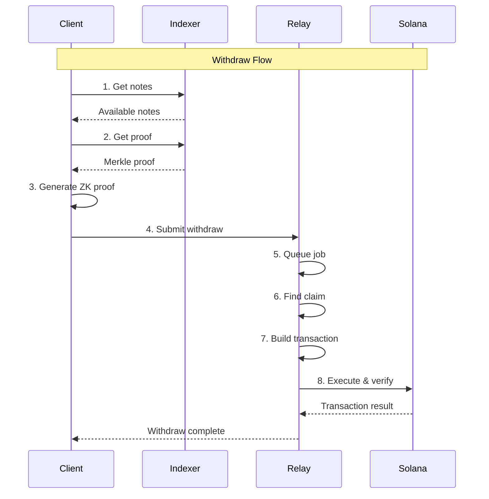

# Withdraw Workflow

The withdraw workflow allows users to spend deposited notes privately, breaking the link between the original deposit and the withdrawal. This guide covers the complete end-to-end process from note discovery to on-chain fund release.

## Overview

A withdrawal proves in zero-knowledge that:
1. The user owns a note (commitment) in the Merkle tree
2. The nullifier has never been used before
3. The output amounts sum correctly (amount - fee)
4. All cryptographic constraints are satisfied

The relay service coordinates proof submission, PoW claim discovery, and transaction execution.

### Key Concepts

**Nullifier:** A unique identifier derived from the note that prevents double-spending:
```
nf = BLAKE3(sk_spend || leaf_index)
```

**Zero-Knowledge Proof:** An SP1 Groth16 proof (260 bytes) that validates:
- Merkle inclusion (commitment exists in tree)
- Nullifier derivation (proves ownership)
- Amount conservation (outputs + fee = amount)
- Outputs binding (specific recipients locked into proof)

**Public Inputs (104 bytes):**
```
root:32 || nf:32 || outputs_hash:32 || amount:8
```

**Relay Service:** Off-chain coordinator that:
- Accepts withdraw requests with proofs
- Finds available PoW claims
- Builds and submits Solana transactions
- Tracks job status and retries

### Architecture Diagram



## Step 1: Discover Spendable Notes

Query the indexer to find notes you own and can spend.

### Scan for Your Notes

```javascript
import { blake3 } from '@noble/hashes/blake3';

async function discoverNotes(
  sk_spend: Uint8Array,
  indexerUrl: string
): Promise<SpendableNote[]> {
  const spendableNotes: SpendableNote[] = [];

  // Query all encrypted notes from indexer
  let start = 0;
  const limit = 100;
  let hasMore = true;

  while (hasMore) {
    const response = await fetch(
      `${indexerUrl}/api/v1/notes/range?start=${start}&limit=${limit}`
    );

    const { notes, has_more } = await response.json();

    for (const encryptedNote of notes) {
      try {
        // Try to decrypt with your key
        const decrypted = await tryDecrypt(
          encryptedNote.encrypted_output,
          sk_spend
        );

        if (decrypted) {
          // This note belongs to you!
          const nullifier = computeNullifier(sk_spend, encryptedNote.leaf_index);

          // Check if already spent
          const isSpent = await checkNullifierSpent(nullifier);

          if (!isSpent) {
            spendableNotes.push({
              commitment: encryptedNote.leaf_commit,
              leaf_index: encryptedNote.leaf_index,
              amount: decrypted.amount,
              r: decrypted.r,
              sk_spend,
              created_at: encryptedNote.created_at,
            });
          }
        }
      } catch (err) {
        // Decryption failed - not your note
        continue;
      }
    }

    start += limit;
    hasMore = has_more;
  }

  return spendableNotes;
}

// Helper: Compute nullifier
function computeNullifier(sk_spend: Uint8Array, leaf_index: number): Uint8Array {
  const indexBytes = new Uint8Array(4);
  new DataView(indexBytes.buffer).setUint32(0, leaf_index, true);

  const preimage = new Uint8Array([...sk_spend, ...indexBytes]);
  return blake3(preimage);
}
```

### Check Nullifier Status

```javascript
// Check if nullifier already used on-chain
async function checkNullifierSpent(nullifier: Uint8Array): Promise<boolean> {
  const connection = new Connection(RPC_URL);

  // Derive nullifier shard PDA
  const nullifierShardPda = deriveNullifierShardPda(
    nullifier,
    CLOAK_PROGRAM_ID
  );

  // Check if account exists and contains this nullifier
  const accountInfo = await connection.getAccountInfo(nullifierShardPda);

  if (!accountInfo) {
    return false; // Shard doesn't exist yet, nullifier unused
  }

  // Parse nullifier set from account data
  const nullifierSet = parseNullifierSet(accountInfo.data);

  return nullifierSet.has(toHex(nullifier));
}
```

**Reference:** `services/indexer/src/server/final_handlers.rs`

## Step 2: Fetch Merkle Proof

Get the cryptographic proof that your commitment exists in the Merkle tree.

### Request Inclusion Proof

```javascript
async function fetchMerkleProof(
  indexerUrl: string,
  leafIndex: number
): Promise<MerkleProof> {
  const response = await fetch(
    `${indexerUrl}/api/v1/merkle/proof/${leafIndex}`
  );

  if (!response.ok) {
    throw new Error(`Merkle proof not found for index ${leafIndex}`);
  }

  const data = await response.json();

  return {
    path_elements: data.path_elements.map(hexToBytes),
    path_indices: data.path_indices, // Array of 0 or 1
    leaf: hexToBytes(data.leaf),
    root: hexToBytes(data.root),
  };
}

// Example response
{
  "path_elements": [
    "1111111111111111111111111111111111111111111111111111111111111111",
    "2222222222222222222222222222222222222222222222222222222222222222",
    // ... up to tree height (32 levels)
  ],
  "path_indices": [0, 1, 0, 1, 0, ...],  // Left/right indicators
  "leaf": "commitment_hash_hex",
  "root": "current_merkle_root_hex"
}
```

### Verify Proof Locally

```javascript
// Verify Merkle proof before using it
function verifyMerkleProof(proof: MerkleProof): boolean {
  let current = proof.leaf;

  for (let i = 0; i < proof.path_elements.length; i++) {
    const sibling = proof.path_elements[i];
    const isLeft = proof.path_indices[i] === 0;

    if (isLeft) {
      // Current is left child
      current = blake3(new Uint8Array([...current, ...sibling]));
    } else {
      // Current is right child
      current = blake3(new Uint8Array([...sibling, ...current]));
    }
  }

  // Final hash should equal root
  return bytesEqual(current, proof.root);
}
```

**Reference:** `docs/api/indexer.md#get-apiv1merkleproofindex`

## Step 3: Prepare Witness & Public Inputs

Gather all data needed for the zero-knowledge proof.

### Build Private Inputs

```typescript
interface PrivateInputs {
  amount: number;           // u64 lamports
  r: string;                // 32-byte hex (randomness from deposit)
  sk_spend: string;         // 32-byte hex (secret spending key)
  leaf_index: number;       // u32 position in tree
  merkle_path: {
    path_elements: string[]; // Array of 32-byte hex
    path_indices: number[];  // Array of 0 or 1
  };
}

const privateInputs: PrivateInputs = {
  amount: note.amount,
  r: toHex(note.r),
  sk_spend: toHex(note.sk_spend),
  leaf_index: note.leaf_index,
  merkle_path: {
    path_elements: proof.path_elements.map(toHex),
    path_indices: proof.path_indices,
  },
};

// Save to file for SP1 prover
fs.writeFileSync(
  'private.json',
  JSON.stringify(privateInputs, null, 2)
);
```

### Build Public Inputs

```typescript
interface PublicInputs {
  root: string;         // 32-byte hex (Merkle root)
  nf: string;           // 32-byte hex (nullifier)
  outputs_hash: string; // 32-byte hex (BLAKE3 of outputs)
  amount: number;       // u64 lamports
}

// Define recipients
const outputs = [
  { address: 'recipient1_pubkey_base58', amount: 400_000 },
  { address: 'recipient2_pubkey_base58', amount: 594_000 },
];

// Compute outputs hash
const outputsHash = computeOutputsHash(outputs);

// Compute nullifier
const nullifier = computeNullifier(sk_spend, leaf_index);

const publicInputs: PublicInputs = {
  root: toHex(proof.root),
  nf: toHex(nullifier),
  outputs_hash: toHex(outputsHash),
  amount: note.amount,
};

// Save to file
fs.writeFileSync(
  'public.json',
  JSON.stringify(publicInputs, null, 2)
);
```

### Build Outputs

```typescript
interface Output {
  address: string;  // Base58 Solana pubkey OR 32-byte hex
  amount: number;   // u64 lamports
}

const outputs: Output[] = [
  {
    address: '9xQeWvG816bUx9EPjHmaT23yvVM2ZWbrrpZb9PusVFin',
    amount: 400_000,
  },
  {
    address: '7yRtcB7dZLq9k8v2w3X4Hn5M8aPxK6jN9oU8sT7vW3Qr',
    amount: 594_000,
  },
];

// Verify conservation
const fee = calculateFee(note.amount, FEE_BPS);
const outputsSum = outputs.reduce((sum, o) => sum + o.amount, 0);

if (outputsSum + fee !== note.amount) {
  throw new Error('Amount conservation violated');
}

// Save to file
fs.writeFileSync(
  'outputs.json',
  JSON.stringify(outputs, null, 2)
);
```

### Compute Outputs Hash

```javascript
function computeOutputsHash(outputs: Output[]): Uint8Array {
  const hasher = blake3.createHash();

  for (const output of outputs) {
    // Convert address to 32 bytes
    const addressBytes = output.address.length === 64
      ? hexToBytes(output.address)
      : base58ToBytes(output.address);

    // Serialize amount as 8-byte LE
    const amountBytes = new Uint8Array(8);
    new DataView(amountBytes.buffer).setBigUint64(0, BigInt(output.amount), true);

    // Hash: address || amount
    hasher.update(addressBytes);
    hasher.update(amountBytes);
  }

  return new Uint8Array(hasher.digest());
}
```

**Reference:** `packages/zk-guest-sp1/guest/src/encoding.rs:85-92`

## Step 4: Generate Zero-Knowledge Proof

Use the SP1 prover to generate a Groth16 proof.

### Local Proving (CPU)

```bash
# Navigate to zk-guest-sp1 package
cd packages/zk-guest-sp1

# Generate proof using host CLI
cargo run --package zk-guest-sp1-host --bin cloak-zk -- prove \
  --private private.json \
  --public public.json \
  --outputs outputs.json \
  --proof out/proof.bin \
  --pubout out/public.bin

# Output:
# 📖 Reading input files...
# ✅ Input files loaded
# 🔧 Setting up SP1 prover client...
# 🔑 Generating proving key (this may take 1-2 minutes)...
# ✅ Proving key generated
# 📝 Preparing circuit inputs...
# 🔨 Generating Groth16 proof (this may take ~2 minutes)...
# 📊 Total cycles: 1,234,567
# ✅ Proof generated!
# 💾 Saving proof to disk...
# Proof generated successfully!
# Proof size: 89234 bytes
# Public inputs size: 104 bytes
```

**Proof Time:**
- Local CPU: ~2 minutes (120 seconds)
- SP1 Network (TEE): ~30-45 seconds

### Network Proving (TEE)

```bash
# Set prover mode to network
export SP1_PROVER=network
export SP1_PRIVATE_KEY=your_sp1_api_key

# Generate proof (same command)
cargo run --package zk-guest-sp1-host --bin cloak-zk -- prove \
  --private private.json \
  --public public.json \
  --outputs outputs.json \
  --proof out/proof.bin \
  --pubout out/public.bin

# Proof generation: ~30-45 seconds via TEE
```

### Programmatic Proving

```rust
use zk_guest_sp1_host::generate_proof;

// Load input files
let private_json = fs::read_to_string("private.json")?;
let public_json = fs::read_to_string("public.json")?;
let outputs_json = fs::read_to_string("outputs.json")?;

// Generate proof
let result = generate_proof(&private_json, &public_json, &outputs_json)?;

println!("Proof size: {} bytes", result.proof_bytes.len());
println!("Cycles: {}", result.total_cycles);
println!("Time: {}ms", result.generation_time_ms);

// Save proof bundle (SP1ProofWithPublicValues)
fs::write("out/proof.bin", &result.proof_bytes)?;

// Save public inputs (104 bytes)
fs::write("out/public.bin", &result.public_inputs)?;
```

**Reference:** `packages/zk-guest-sp1/README.md`, `docs/packages/zk-guest-sp1.md`

## Step 5: Submit to Relay

Send the proof and metadata to the relay service for execution.

### Build Withdraw Request

```javascript
// Load proof bundle
const proofBytes = fs.readFileSync('out/proof.bin');
const proofBase64 = Buffer.from(proofBytes).toString('base64');

// Build request
const withdrawRequest = {
  outputs: [
    { recipient: '9xQeWvG...', amount: 400_000 },
    { recipient: '7yRtcB7...', amount: 594_000 },
  ],
  policy: {
    fee_bps: 60, // 0.6%
  },
  public_inputs: {
    root: toHex(proof.root),
    nf: toHex(nullifier),
    amount: note.amount,
    fee_bps: 60,
    outputs_hash: toHex(outputsHash),
  },
  proof_bytes: proofBase64,
};
```

### Submit via HTTP

```javascript
async function submitWithdraw(request) {
  const response = await fetch('http://localhost:3002/withdraw', {
    method: 'POST',
    headers: {
      'Content-Type': 'application/json',
    },
    body: JSON.stringify(request),
  });

  if (!response.ok) {
    const error = await response.json();
    throw new Error(`Withdraw failed: ${error.error.message}`);
  }

  const result = await response.json();

  console.log('✅ Withdraw queued');
  console.log('Request ID:', result.data.request_id);
  console.log('Status:', result.data.status);

  return result.data.request_id;
}

// Example response
{
  "success": true,
  "data": {
    "request_id": "550e8400-e29b-41d4-a716-446655440000",
    "status": "queued",
    "message": "Withdraw request received and queued for processing"
  }
}
```

### Monitor Job Status

```javascript
async function waitForCompletion(requestId: string, timeout = 120_000) {
  const start = Date.now();
  const pollInterval = 2000; // 2 seconds

  while (Date.now() - start < timeout) {
    const response = await fetch(`http://localhost:3002/status/${requestId}`);
    const status = await response.json();

    console.log(`Status: ${status.status}`);

    if (status.status === 'completed') {
      console.log('✅ Withdraw completed!');
      console.log('Transaction:', status.tx_id);
      return status.tx_id;
    }

    if (status.status === 'failed') {
      throw new Error(`Withdraw failed: ${status.error}`);
    }

    // Wait before polling again
    await new Promise(resolve => setTimeout(resolve, pollInterval));
  }

  throw new Error('Withdraw timeout - still processing');
}
```

**Reference:** `docs/api/relay.md#post-withdraw`

## Step 6: Relay Worker Processing

The relay worker processes queued jobs and submits transactions.

### Job Lifecycle

```
queued → processing → completed
                   ↘ failed
```

**States:**
- `queued` - Job in database queue, not started
- `processing` - Worker actively building/submitting transaction
- `completed` - Transaction confirmed on-chain
- `failed` - Error occurred (proof invalid, no claims, tx failed)

### Processing Phases

**Phase 1: Validation**
```rust
// Validate proof format
let proof = extract_groth16_260_sp1(&proof_bundle)?;
let public_inputs = parse_public_inputs_104_sp1(&proof_bundle)?;

// Verify shapes
if proof.len() != 260 {
    return Err(Error::InvalidProof);
}

if public_inputs.amount == 0 {
    return Err(Error::InvalidAmount);
}
```

**Phase 2: Outputs Hash Verification**
```rust
// Recompute outputs hash
let computed_hash = compute_outputs_hash(&job.outputs);

// Must match public input
if computed_hash != public_inputs.outputs_hash {
    return Err(Error::OutputsMismatch);
}
```

**Phase 3: Amount Conservation**
```rust
// Calculate fee
let fee = calculate_fee(public_inputs.amount, job.policy.fee_bps);

// Sum outputs
let outputs_sum: u64 = job.outputs.iter().map(|o| o.amount).sum();

// Verify conservation
if outputs_sum + fee != public_inputs.amount {
    return Err(Error::AmountMismatch);
}
```

**Phase 4: PoW Claim Discovery**
```rust
// Find available wildcard claim
let claim_finder = ClaimFinder::new(rpc_client, registry_program_id);

let claim = claim_finder
    .find_wildcard_claim()
    .await?
    .ok_or(Error::NoClaimsAvailable)?;

info!("Found claim: {}", claim.claim_pda);
```

**Phase 5: Transaction Building**
```rust
// Build withdraw instruction
let withdraw_ix = build_withdraw_instruction(
    &proof,
    &public_inputs,
    &job.outputs,
    &claim,
)?;

// Build transaction
let tx = Transaction::new_with_payer(
    &[withdraw_ix],
    Some(&payer.pubkey()),
);

// Simulate to get compute units
let simulation = rpc_client.simulate_transaction(&tx).await?;
let cu_consumed = simulation.value.units_consumed.unwrap_or(200_000);

// Set compute budget
tx.add_compute_budget(cu_consumed + 10_000)?;
```

**Phase 6: Submission**
```rust
// Sign transaction
tx.sign(&[&payer], recent_blockhash);

// Submit to Solana
let signature = rpc_client
    .send_and_confirm_transaction(&tx)
    .await?;

info!("Transaction confirmed: {}", signature);

// Update job status
update_job_status(&job_id, JobStatus::Completed, Some(signature)).await?;
```

**Reference:** `services/relay/src/worker.rs`

## Step 7: On-Chain Execution

The shield-pool program validates and executes the withdraw.

### Withdraw Instruction Execution

```rust
pub fn withdraw(
    ctx: Context<Withdraw>,
    proof: [u8; 260],
    public_inputs: [u8; 104],
    outputs: Vec<Output>,
) -> Result<()> {
    // 1. Verify SP1 proof
    sp1_solana::verify_proof(&proof, &public_inputs, &VKEY_HASH)?;

    // 2. Parse public inputs
    let root = &public_inputs[0..32];
    let nf = &public_inputs[32..64];
    let outputs_hash = &public_inputs[64..96];
    let amount = u64::from_le_bytes(public_inputs[96..104].try_into()?);

    // 3. Verify root in ring buffer
    require!(ctx.accounts.roots_ring.contains(root), ErrorCode::RootNotFound);

    // 4. Check nullifier unused
    require!(!ctx.accounts.nullifier_shard.contains(nf), ErrorCode::NullifierUsed);

    // 5. Mark nullifier as spent
    ctx.accounts.nullifier_shard.insert(nf)?;

    // 6. Verify outputs hash
    let computed_hash = compute_outputs_hash(&outputs);
    require!(computed_hash == outputs_hash, ErrorCode::OutputsHashMismatch);

    // 7. Verify conservation
    let fee = calculate_fee(amount, FEE_BPS);
    let outputs_sum: u64 = outputs.iter().map(|o| o.amount).sum();
    require!(outputs_sum + fee == amount, ErrorCode::AmountMismatch);

    // 8. Transfer funds to recipients
    for output in outputs {
        transfer_from_pool(output.address, output.amount)?;
    }

    // 9. Transfer fee to treasury
    transfer_from_pool(treasury, fee)?;

    // 10. PoW claim consumption (CPI)
    if let Some(claim_info) = ctx.remaining_accounts.get(0) {
        scramble_registry::cpi::consume_claim(
            claim_ctx,
            batch_hash,
        )?;
    }

    emit!(WithdrawEvent {
        nullifier: *nf,
        amount,
        outputs_count: outputs.len() as u8,
    });

    Ok(())
}
```

**Verification Steps:**
1. SP1 proof cryptographically verified
2. Merkle root exists in recent roots buffer (last 64 roots)
3. Nullifier never used before (double-spend protection)
4. Outputs hash matches (recipients locked to proof)
5. Amount conservation (no inflation)
6. Funds transferred to recipients
7. Fee transferred to treasury
8. PoW claim consumed (if provided)
9. Event emitted for indexer

**Reference:** `programs/shield-pool/src/instructions/withdraw.rs`

## Complete Example

Here's a full end-to-end example in TypeScript:

```typescript
import { Connection, Keypair } from '@solana/web3.js';
import { blake3 } from '@noble/hashes/blake3';

async function withdrawFromShieldPool(
  connection: Connection,
  note: SpendableNote,
  recipients: Array<{ address: string; amount: number }>
): Promise<string> {
  console.log('🔍 Step 1: Fetching Merkle proof...');

  // 1. Get Merkle proof
  const proof = await fetchMerkleProof(INDEXER_URL, note.leaf_index);

  console.log('✅ Merkle proof fetched');
  console.log('📊 Root:', toHex(proof.root));

  // 2. Prepare inputs
  console.log('📝 Step 2: Preparing witness inputs...');

  const privateInputs = {
    amount: note.amount,
    r: toHex(note.r),
    sk_spend: toHex(note.sk_spend),
    leaf_index: note.leaf_index,
    merkle_path: {
      path_elements: proof.path_elements.map(toHex),
      path_indices: proof.path_indices,
    },
  };

  const nullifier = computeNullifier(note.sk_spend, note.leaf_index);
  const outputsHash = computeOutputsHash(recipients);

  const publicInputs = {
    root: toHex(proof.root),
    nf: toHex(nullifier),
    outputs_hash: toHex(outputsHash),
    amount: note.amount,
  };

  // 3. Generate proof
  console.log('🔨 Step 3: Generating ZK proof...');
  console.log('⏳ This may take ~2 minutes locally, or ~30-45 seconds with SP1 network');

  const proofResult = await generateProof(privateInputs, publicInputs, recipients);

  console.log('✅ Proof generated!');
  console.log('📊 Cycles:', proofResult.total_cycles);
  console.log('⏱️  Time:', proofResult.generation_time_ms, 'ms');

  // 4. Submit to relay
  console.log('📤 Step 4: Submitting to relay...');

  const requestId = await submitWithdraw({
    outputs: recipients,
    policy: { fee_bps: 60 },
    public_inputs: publicInputs,
    proof_bytes: Buffer.from(proofResult.proof_bytes).toString('base64'),
  });

  console.log('✅ Withdraw submitted');
  console.log('📋 Request ID:', requestId);

  // 5. Wait for completion
  console.log('⏳ Step 5: Waiting for transaction...');

  const txId = await waitForCompletion(requestId, 120_000);

  console.log('✅ Withdraw completed!');
  console.log('🔗 Transaction:', txId);
  console.log(`🌐 Explorer: https://solscan.io/tx/${txId}`);

  // 6. Mark note as spent
  note.spent = true;
  note.spent_at = new Date().toISOString();
  note.spent_tx = txId;

  await updateNote(note);

  return txId;
}
```

## Failure & Troubleshooting

### Proof Generation Failures

**Scenario: Circuit Constraint Failed**
```
Error: Circuit constraint verification failed
Caused by: Merkle path verification failed
```

**Cause:** Invalid Merkle proof or mismatched data

**Solution:**
- Verify Merkle proof locally before proving
- Ensure root from indexer is current
- Check leaf_index matches note
- Regenerate proof if tree updated

---

**Scenario: Amount Conservation Failed**
```
Error: Amount conservation failed: outputs(994000) + fee(6000) != amount(1000000)
```

**Cause:** Outputs sum doesn't match amount - fee

**Solution:**
```javascript
// Correct calculation
const fee = calculateFee(amount, fee_bps);
const availableForOutputs = amount - fee;

// Split among recipients
const outputs = [
  { address: 'recipient1', amount: Math.floor(availableForOutputs * 0.4) },
  { address: 'recipient2', amount: Math.floor(availableForOutputs * 0.6) },
];

// Verify
const sum = outputs.reduce((s, o) => s + o.amount, 0);
console.assert(sum + fee === amount);
```

### Relay Submission Failures

**Scenario: No Claims Available**
```
{
  "success": false,
  "error": {
    "code": "NoClaimsAvailable",
    "message": "No PoW claims available for consumption"
  }
}
```

**Cause:** No miners have submitted wildcard claims

**Solution:**
- Wait for miners to submit claims
- Check miner status: `cloak-miner status`
- Lower difficulty if mining too slow
- Use fallback non-PoW mode (if enabled)

---

**Scenario: Nullifier Already Used**
```
{
  "success": false,
  "error": {
    "code": "NullifierAlreadyUsed",
    "message": "Nullifier exists on-chain"
  }
}
```

**Cause:** This note was already withdrawn

**Solution:**
- Check note status in local wallet
- Query on-chain to verify nullifier used
- Do not retry - funds already withdrawn
- Update note record as spent

### On-Chain Failures

**Scenario: Root Not Found**
```
Program log: Error: RootNotFound
```

**Cause:** Merkle root not in the 64-root ring buffer

**Solution:**
- Fetch fresh root from indexer
- Use recent root (last 64 roots kept)
- Regenerate proof with new root
- Resubmit withdraw request

---

**Scenario: Invalid Proof**
```
Program log: SP1 verification failed
```

**Cause:** Proof doesn't verify or VKey mismatch

**Solution:**
- Ensure circuit version matches deployed program
- Check VKey hash in shield-pool program
- Regenerate proof with correct circuit
- Verify proof generation didn't error

## Security Considerations

**Nullifier Privacy:**
- Nullifier reveals which note was spent
- On-chain analysis can link deposits to withdrawals if not careful
- Use random delays between deposit and withdrawal
- Mix funds through multiple deposits/withdrawals

**Timing Analysis:**
- Immediate withdraw after deposit reveals link
- Wait random time period (hours/days)
- Batch withdraws with other users if possible
- Use round amounts for better anonymity

**Recipient Privacy:**
- Withdraw to fresh addresses not linked to deposit address
- Consider using multiple recipients to obscure amounts
- Avoid reusing recipient addresses
- Use intermediate addresses for additional mixing

**Proof Reuse:**
- Each proof is single-use (bound to specific nullifier)
- Cannot reuse proof even for same amount
- Outputs hash prevents changing recipients
- Root binding prevents using old tree state

## Related Documentation

- **[Deposit Workflow](./deposit.md)** - How to create notes
- **[PoW Withdraw](./pow-withdraw.md)** - PoW claim integration details
- **[ZK Guest SP1](../packages/zk-guest-sp1.md)** - Proof generation
- **[Relay Service](../offchain/relay.md)** - Job processing
- **[Relay API](../api/relay.md)** - API endpoints
- **[Shield Pool Program](../onchain/shield-pool.md)** - On-chain verification
